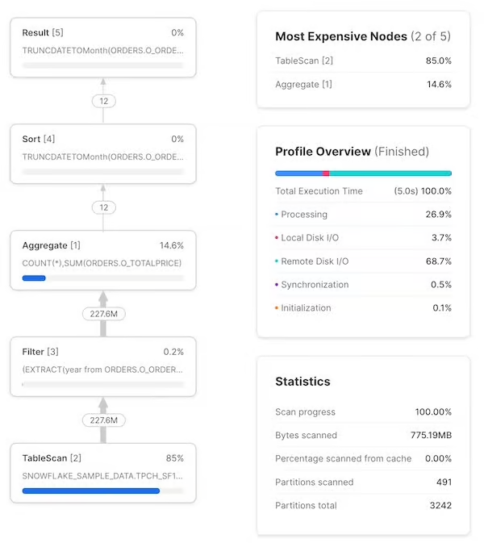

[Back to README](../README.md) | Previous: [Overview.md](Overview.md) | Next: [DataExchange.md](../8. MarketplaceAndDataExchange/DataExchange.md)

# Query Best Practices

*Notes related to SQL and Querying: Best practices for writing efficient queries in Snowflake.*

## Key Topics
*   **Understanding the Query Profile:**
    *   How to access and interpret the Query Profile in Snowsight.
    
    *   Identifying bottlenecks (e.g., full table scans, inefficient joins, data spillage).
*   **Data Pruning:**
    *   Selecting only necessary columns (`SELECT col1, col2` instead of `SELECT *`).
    *   Using effective `WHERE` clause predicates to leverage micro-partition pruning.
    *   Understanding how clustering keys enhance pruning.
*   **Join Optimization:**
    *   Choosing appropriate join types.
    *   Ensuring join keys are of the same data type.
    *   Avoiding Cartesian products.
*   **Minimizing Data Movement:** Understanding operations that cause data shuffling.
*   **Using Appropriate Data Types:** For storage efficiency and join performance.
*   **Leveraging Caching:** Understanding how result cache and warehouse cache work.
*   **Avoiding Unnecessary Complexity:** Simplifying queries where possible.
*   **UNION vs. UNION ALL:** Use `UNION ALL` if duplicate removal is not needed.
*   **Working with Semi-Structured Data:** Efficient querying patterns for VARIANT data.
